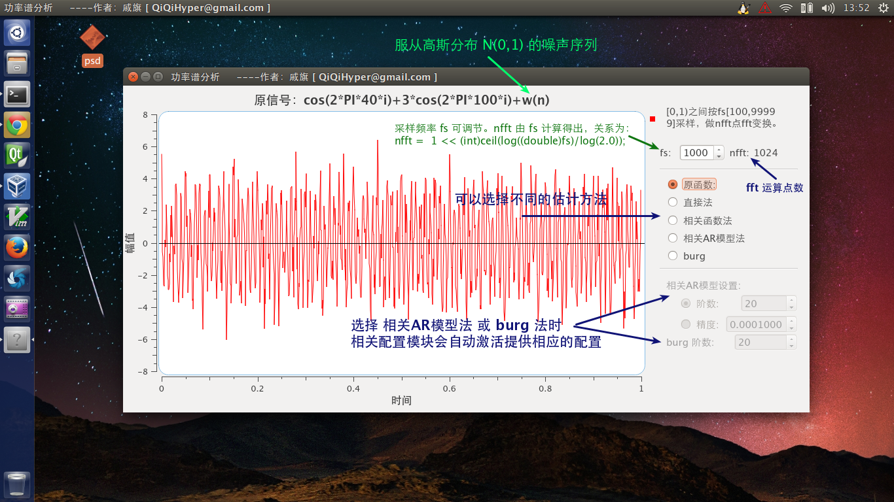

psd
===

这是一个使用 C/C++ 编写的 **功率谱分析** 程序。运算部分是纯 C 的，图形使用的是 Qt 库。实现了不同采样频率下 直接法，自相关函数法，相关 AR 模型法， Burg法 估计功率谱的方法

欢迎大家 fork 这个项目并 pull request，提出相关开发意见与 bug 反馈。还需要下面两项完善工作：

- 提供原信号输入接口
- 自由设置采样区间

**演示：**

[视频地址：http://v.youku.com/v_show/id_XNzA2NjY5MTc2.html](http://v.youku.com/v_show/id_XNzA2NjY5MTc2.html)

## 编译环境

- Ubuntu 14.04 trusty LTS
- Qt 5.2.1
- qwt 6.1.0

使用 Qt Creator 将 psd.pro 文件添加进 Qt 工程编译即可（需要 qwt 6.1.0插件支持）。
